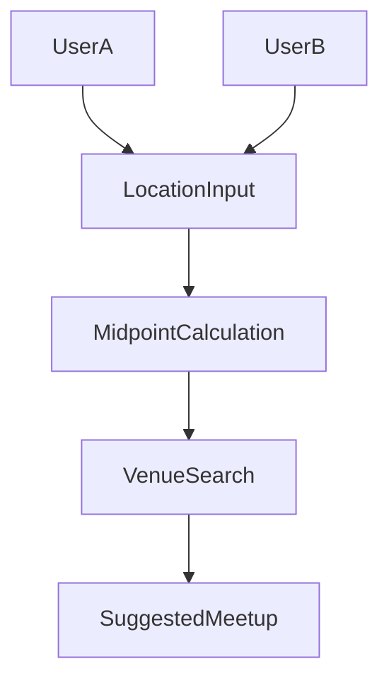

# Project State — The Middle

## Purpose

This document records the current development state of **The Middle** project at the time the Tempo development environment was shut down.

The goal is to preserve knowledge about:

- what the application is supposed to do
- what currently exists in the repository
- what is incomplete
- what the intended MVP looks like

This prevents the classic problem:

> "What was I building again?"

when returning to the project later.

---

# Project Concept

The Middle is a **location-based meetup coordination application**.

The core idea:

Two or more users choose their starting locations and the system calculates an optimal meeting location that is approximately equal travel distance for everyone.

### Example use cases

- meeting friends halfway between cities
- planning social meetups
- coordinating dates
- choosing restaurants between neighborhoods

---

# Core Product Idea

## Problem

Choosing a meetup location between people in different locations can be inconvenient and time-consuming.

## Solution

Automatically calculate a midpoint and recommend places nearby.

Users enter:

- their location
- a friend's location
- optional preferences

The system suggests:

- midpoint location
- nearby venues
- map view

---

# MVP Feature Set

The intended **minimum viable product (MVP)** includes:

- User location input
- Map visualization
- Midpoint calculation
- Nearby venue discovery
- Session sharing
- Simple invite link

The MVP should allow **two people to quickly find a place to meet**.

---

# Current Repository Features

From code inspection, the repository currently contains:

- React frontend
- Vite development server
- Tailwind styling
- Supabase integration
- Basic application routing
- Session/page components

The following files suggest existing UI flows:

```
src/pages/HomePage.tsx
src/pages/SessionPage.tsx
```

These likely represent the main user journeys.

---

# Known Incomplete Areas

The following areas likely require further development:

- UI polishing
- Map integration
- Venue recommendation logic
- Improved location search
- User authentication flow
- Sharing and invite features
- Mobile usability improvements

---

# Data Model (Estimated)

Based on the application concept, the database likely includes tables similar to:

- users
- sessions
- locations
- venues
- participants

The exact schema can be reviewed in:

```
supabase/migrations/
backup.sql
```

---

# Development Status

Current development stage:

**Prototype / early product stage**

The application architecture exists but the feature set is incomplete.

The project was paused before reaching a public MVP.

---

# Future Development Priorities

Suggested order of development when restarting:

1. Confirm map integration
2. Implement midpoint calculation
3. Implement venue discovery
4. Improve user experience
5. Add session sharing links
6. Add authentication (if needed)
7. Improve mobile UI

---

# Open Questions / Unknowns

These areas may require decisions during future development:

- Which map provider should be used?
  - Google Maps
  - Mapbox
  - OpenStreetMap

- How should venue search work?
  - external API (Google Places / Yelp)
  - internal dataset

- Should authentication be required for MVP?

- Should sessions be stored permanently or temporarily?

---

# Next Development Session Checklist

When restarting development:

1. Resume Supabase project if paused
2. Confirm environment variables are configured
3. Run the development server

```
npm install
npm run dev
```

4. Verify Supabase connection
5. Review `PROJECT_STATE.md` and `ARCHITECTURE.md`
6. Resume work on MVP priorities

---

# Long Term Vision

Future versions of The Middle could include:

- group meetups (more than two people)
- travel time optimization
- restaurant and venue filtering
- calendar integration
- friend lists
- location history
- smart recommendations

---

# Project Status

```
Status: paused
Infrastructure: active
Database: preserved
Codebase: preserved
```

Development can resume at any time using the repository.

---


